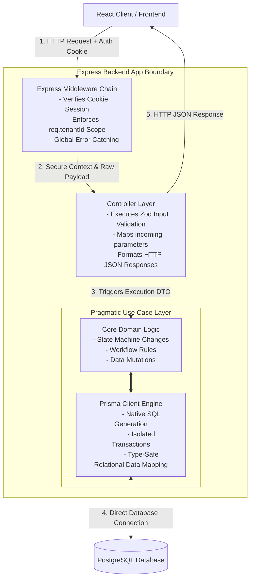

# System Architecture Specifications

This document defines the **technical architecture**, **operational layers**, **execution flow**, **directory organization**, and **data isolation mechanisms** for the Service Tenant ERP platform. It acts as the definitive engineering blueprint for building the platform's core engine.

## HTTP Requests Lifecycle & Backend Layer Architecture

The backend engine processes incoming requests thought a sequence of **decoupled layers**. Each layer has a singular responsibility and can only communicate with the layer beneath it.

The application adopts a **Clean Request Pipeline**, consisting of a **Infrastructural Middleware Chain** feeding into a **Pragmatic 2-Layer Model** (Controller &rarr; Use Case). This design decouples HTTP transport mechanics and multi-tenant routing from domain business while keeping data access straightforward via Prisma ORM.

### Request Lifecycle Diagram

### Layer Responsabilities

* **Express Middleware Chain:** Handles session extraction, tenant verification (binding `req.tenantId`), and global exception catching. 
* **Controller Layer:** Executes structural validation via *Zod*, transforms raw parameters into type-safe DTOs, and sets HTTP status responses.
* **Pragmatic Use Case Layer:** Executes core domain logic and runs direct *Prisma Client* queries.

