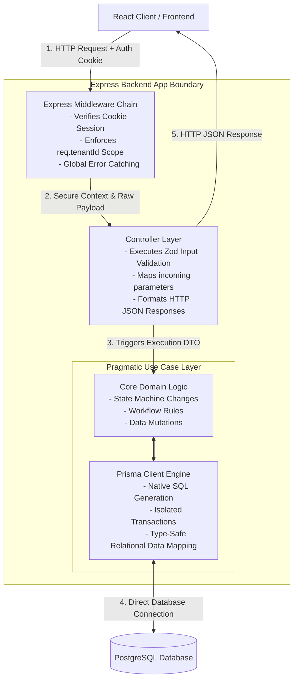
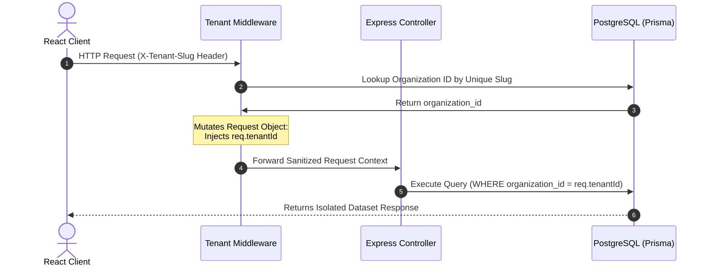

# System Architecture Specifications

This document defines the **technical architecture**, **operational layers**, **execution flow**, **directory organization**, and **data isolation mechanisms** for the Service Tenant ERP platform. It acts as the definitive engineering blueprint for building the platform's core engine.


## HTTP Requests Lifecycle & Backend Layer Architecture

The backend engine processes incoming requests thought a sequence of **decoupled layers**. Each layer has a singular responsibility and can only communicate with the layer beneath it.

The application adopts a **Clean Request Pipeline**, consisting of a **Infrastructural Middleware Chain** feeding into a **Pragmatic 2-Layer Model** (Controller &rarr; Use Case). This design decouples HTTP transport mechanics and multi-tenant routing from domain business while keeping data access straightforward via Prisma ORM.

### Request Lifecycle Diagram



### Layer Responsibilities

* **Express Middleware Chain:** Handles session extraction, tenant verification (binding `req.tenantId`), and global exception catching. 
* **Controller Layer:** Executes structural validation via *Zod*, transforms raw parameters into type-safe DTOs, and sets HTTP status responses.
* **Pragmatic Use Case Layer:** Executes core domain logic and runs direct *Prisma Client* queries.

## Directory and File System Organization

The project uses a **Feature-Based Modular Structure** under `src/modules`. Code is organized around business domain entities rather than technical roles.

```text
backend/
├── prisma/
│   ├── schema.prisma
│   ├── migrations/
│   └── seed.ts
├── src/
│   ├── config/
│   │   └── env.ts                  # Runtine environment parsing via Zod
│   ├── middleware/
│   │   ├── auth.middleware.ts
│   │   ├── tenant.middleware.ts    # Tenant resolution binding req.tenantId
│   │   └── error.middleware.ts
│   ├── types/
│   │   └── express.d.ts            # Express request augmentation for tenant context
│   ├── utils/
│   └── modules/                    # Domain Feature Modules
│       ├── auth/
│       ├── users/
│       ├── customers/
│       ├── projects/
│       ├── tasks/
│       ├── expenses/
│       └── invoices/
│           ├── [module].routes.ts
│           ├── [module].controller.ts
│           ├── [module].schemas.ts
│           └── use-cases/           #Single-purpose transaction handlers
│               ├── create-[entity].ts
│               └── update-[entity].ts
│   ├── app.ts
│   └── server.ts
├── Dockerfile
├── eslint.config.js
└── tsconfig.json
```

## Multi-Tenancy & Data Isolation

Data privacy and multi-tenancy isolation are enforced via **Tenant slug-to-ID injection and practical denormalization**, adding an `organization_id` column to all tenant-specific tables.

### Tenant Resolution and Request Flow

To support identical email credential across multiple independent organization boundaries, authentication is explicitly isolated by tenant scopes.



### Front-end & Back-end Coordination for Specific Slug Request

To keep API endpoints simple and elegant and because we control both the back-end and front-end, slugs will be extracted from the url in the front-end and added as a HTTP custom header `X-Tenant-Slug`.
