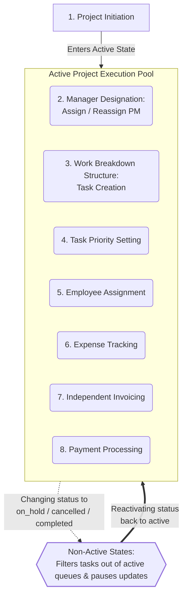

## Business Proceses & Workflows

This document outlines the core business capabilities and user journeys supported by the current Service Tenant ERP.

These workflows shape our architectural boundaries, database relationships, and API contracts, reflecting the real-world operations carried out by future users.

## 1. Core Value Loop: Project Delivery to Billing

The foundational lifecycle of a business engagement, mapping how client demands are structured into trackable tasks, assigned to employees, monitored for expenses, and ultimately invoiced.

- **Primary Actor:** Organization Owner, Project Manager (PM) and Assigned Employees
- **Pre-Conditions:** A `Client` profile exists in the system directory.
- **Success State:** The project is completed, an invoice is generated, and the financial dashboard is updated.

### Core Lifecycle and Dynamic Operations

**Note on Operation Order:** While the list below represents the foundational setup lifecycle of a project, when a project is `active` updates and changes to its state and data can occur independently at any time.

1. **Project Initiation (Owner):** The Owner creates a new `Project` record, setting its `due_date` and `priority` level (`Low`, `Medium`, `High`).
2. **Manager Designation (Owner):** The Owner designates a manager from among themselves and their employees.
3. **Work Breakdown Structure (Manager):** The designated Project Manager outlines the project scope by creating distinct `Tasks`.
4. **Task Priority Setting (Manager):** The Manager assigns a `priority` level (`Low`, `Medium`, `High`) to each task. New tasks default to `Medium`.
5. **Employee Assignment (Manager):** The Manager links one or more `Employee` records to each task, automatically populating the respective employees' work queues with the assigned tasks.
6. **Expense Tracking (Manager):** The Manager logs operational and material `Expense` records against the `Project` to track internal costs.
7. **Independent Invoicing (Owner):** The Owner generates an `Invoice` at any time, independently of the logged internal expenses.
8. **Payment Processing (Owner):** Upon receiving client payment, the Owner updates the invoice status to `Paid`, which automatically refreshes the organization's revenue metrics.
9. **Lifecycle State Transitions (Owner):** At any point, the Owner can update the `Project` status to `on_hold` or `cancelled`. The system dynamically filters those tasks from the assigned employees' work queues without altering individual task histories.

### Core Lifecycle Diagram

