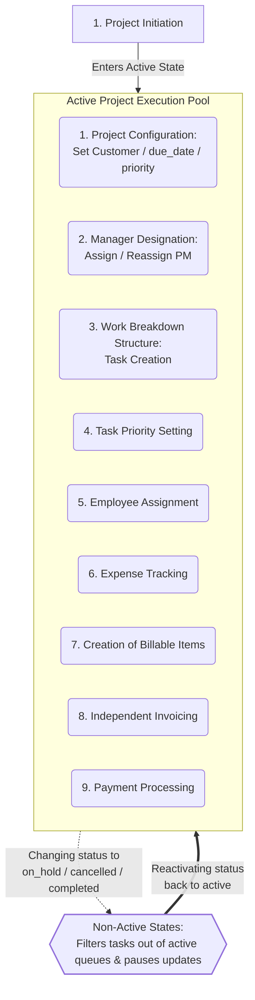
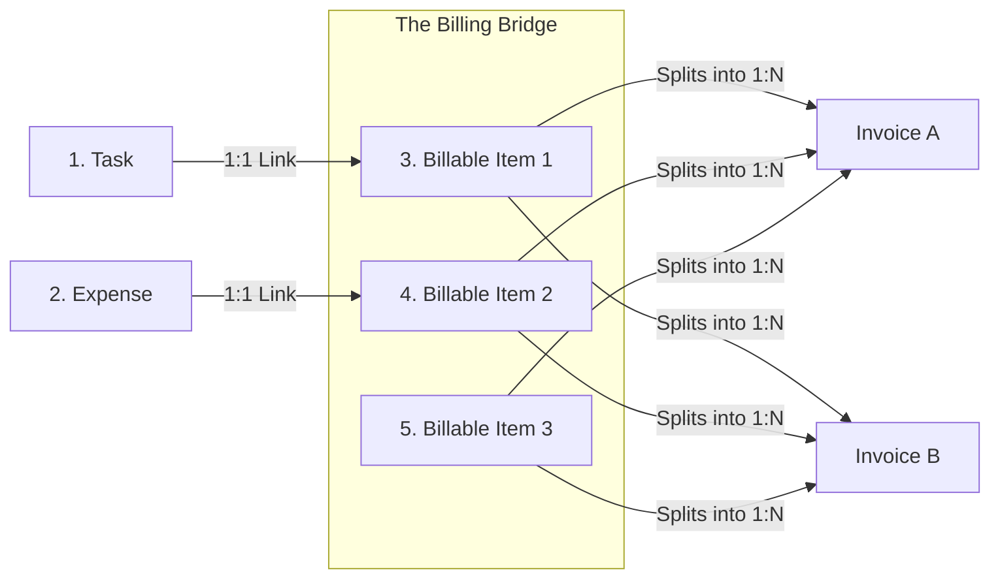

## Business Proceses & Workflows

This document outlines the core business capabilities and user journeys supported by the current Service Tenant ERP.

These workflows shape the architectural boundaries, database relationships, and API contracts, reflecting the real-world operations carried out by future users.

## 1. Core Value Loop: Project Delivery to Billing

The foundational lifecycle of a business engagement, mapping how client demands are structured into trackable tasks, assigned to employees, monitored for expenses, and ultimately invoiced.

- **Primary Actor:** Organization Owner, Project Manager (PM) and Assigned Employees
- **Pre-Conditions:** A `Customer` profile exists in the system directory.
- **Success State:** The project is completed, an invoice is generated, and the financial dashboard is updated.

### Core Lifecycle and Dynamic Operations

**Note on Operation Order:** While the list below represents the foundational setup lifecycle of a project, when a project is `active` its state and data can be updated independently at any time.

1. **Project Initiation & Configuration (Owner):** The Owner creates a new `Project` record. Linking it to a `Customer` profile and setting its `due_date` and `priority` level (`Low`, `Medium`, `High`). The project is now `active` and these global parameters can be modified at any point.
2. **Manager Designation (Owner):** The Owner designates a manager from among themselves and their employees.
3. **Work Breakdown Structure (Manager):** The designated Project Manager outlines the project scope by creating distinct `Tasks`.
4. **Task Priority Setting (Manager):** The Manager assigns a `priority` level (`Low`, `Medium`, `High`) to each task. New tasks default to `Medium`.
5. **Employee Assignment (Manager):** The Manager links one or more `Employee` records to each task, automatically populating the respective employees' work queues with the assigned tasks.
6. **Expense Tracking (Manager):** The Manager logs operational and material `Expense` records against the `Project` to track internal costs.
7. **Creation of Billable Items (Manager):** The Manager can generate `Billable Item` from tasks, expenses or as a independent flat-fee structure with no source. A `Billable Item` can be split and distributed across one or multiple `Invoice` records via `Billable Item Portion`. 
8. **Independent Invoicing (Owner):** The Owner generates an `Invoice` at any point composed of one or more `Billable Item Portion`. The billing reicipient could be the linked `Customer` or any other billing entity defined at that time.
9. **Payment Processing (Owner):** Upon receiving client payment, the Owner updates the invoice status to `Paid`, which automatically refreshes the organization's revenue metrics.
10. **Lifecycle State Transitions (Owner):** At any point, the Owner can update the `Project` status to `on_hold` or `cancelled`. The system dynamically filters those tasks from the assigned employees' work queues without altering individual task histories.

### Core Lifecycle Diagram

### Billing Diagram Flow

### Core Domain Nouns & Actions

* **`Project`**: Serves as the primary operational container. Tracks mutable global properties (`customer`, `due_date`, `manager`, and `priority`) and transitions through states (`active`, `on_hold`, `completed`, `cancelled`).
* **`Owner`**: A User with admin permissions over the Organization. Creates new projects, sets global properties, designates Managers, and generates or updates Invoices. Can invite other Users as employees and create Customers.
* **`Organization`**: Centralizes and contains all projects, history, employee staff, and customer list.
* **`Manager`**: A User linked to an Organization with a Manager role over a specific Project. Can create tasks, assign employees to them, and log expenses.
* **`Task`**: The minimal unit of work to be done. Generated continuously during project execution, each task has a `priority` level and transitions through states (`todo`, `in_progress`, `cancelled`, `done`).
* **`Expense`**: An operational or material cost record. Any number of expenses can be logged into a Project.
* **`Billable Item`**: A financial representation of an expense, task, or arbitrary concept generated to be charged to a client. It acts as a value container that can be divided into distinct portions and distributed across one or multiple invoices.
* **`Invoice`**: An on-demand billing record composed of Billable Items. Any number of invoices can be generated and linked to a Project, remaining completely independent of expenses. Transitions through states (`draft`, `sent`, `paid`, `void`, where `void` represents an issued invoice that was subsequently cancelled).
* **`Employee`**: A User linked to an Organization who was invited by the Owner. Maintains a personal queue of tasks to be done and can be set as the Manager of any number of projects.
* **`Customer`**: An external client profile sponsoring the business engagement. Serves as the default relationship linked to the Project and can be set as the billing recipient.