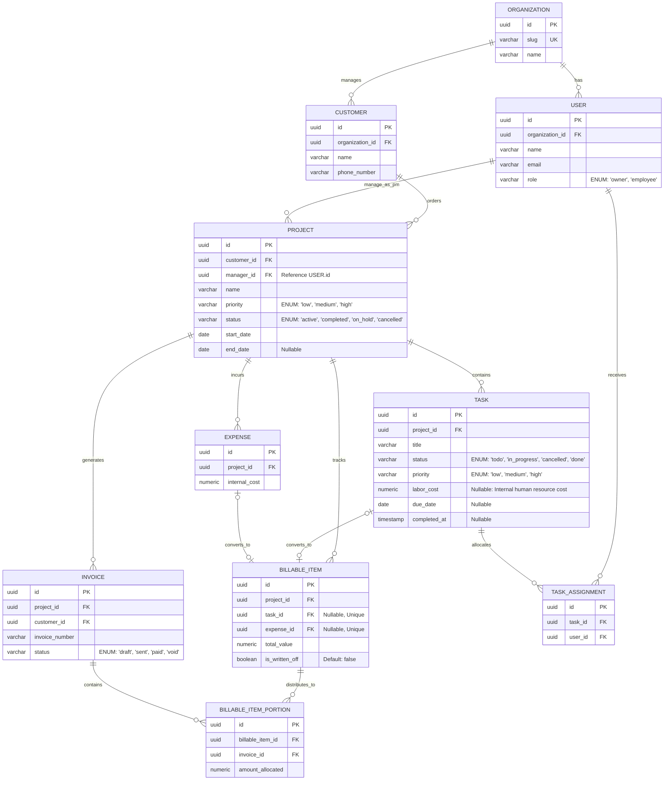

# Database Architecture

This document specifies the physical data relationships and core implementation decisions designed to support the Service Tenant ERP.

## Core Design Decisions

* **Strict Multi-Tenancy Isolation:** To guarantee data privacy, every operational record is tied to a single root `Organization`. Tenants can never access or view data belonging to another organization.
* **Single-Tenant User Profile:** For the initial version of this system, a `User` record is strictly linked to exactly one `Organization` and is assigned a single unique `role`. Supporting a single user profile that can connect to multiple independent organizations is a feature left for future development.
* **Target Database Engine:** The physical schema is designed specifically for **PostgreSQL**. The implementation leverages Postgre-native capabilities such as explicit Foreign keys.
* **Pragmatic Denormalization:** The physical schema intentionally violates the **Third Normal Form (3NF)** of normalization by cascading the `organization_id` down to every single table, to prevent deep, expensive relational joins and safely filter all tenant data in a single, fast operation.
* **Global Metadata Omission:** For clarity, `created_at`, `updated_at`, `organization_id`, `notes`, and `description` columns are omitted from visual ERD diagrams to keep the focus on core business data and relationships.
* **Unified Role-Based Authorization:** The `User` entity serves as a single unified table representing all internal actors, including both `Owner` and `Employee`. Functional permissions and access controls are dynamically determined at runtime by evaluating the user's assigned role.
* **Financial Audit Preservation:** In accordance with standard accounting principles, `Invoice` records are never physically deleted from the system. If an invoice is cancelled, its status column is mutated to `void`.
* **Tenant-scoped Authentication Credentials:** To support identical usernames or duplicate emails accros diferent tenants, the authentication system requires a unique organization `slug` alongside individual credentials at login. The application resolves the tenant by this slug first, ensuring usernames only need to be unique within their respective organization boundaries.
* **Decoupled Financial Valuation:** To protect financial integrity, a `BillableItem` generated from an `Expense` or `Task` stores and independent mutable pricing value. If the cost attributes of the task of expense changes, the contracted value remains securely unaffected.
* **Inmutable Invoicing Portions:** Once a `BillableItemPortion` is allocated to an `Invoice`, its `amount_allocated` is completely immutable. This acts as a permanent historical audit trail, allowing the system to safely recalculate remaining unbilled item balances dynamically without risking cross-document mutation.

## Entity-Relationship Diagram (ERD)

