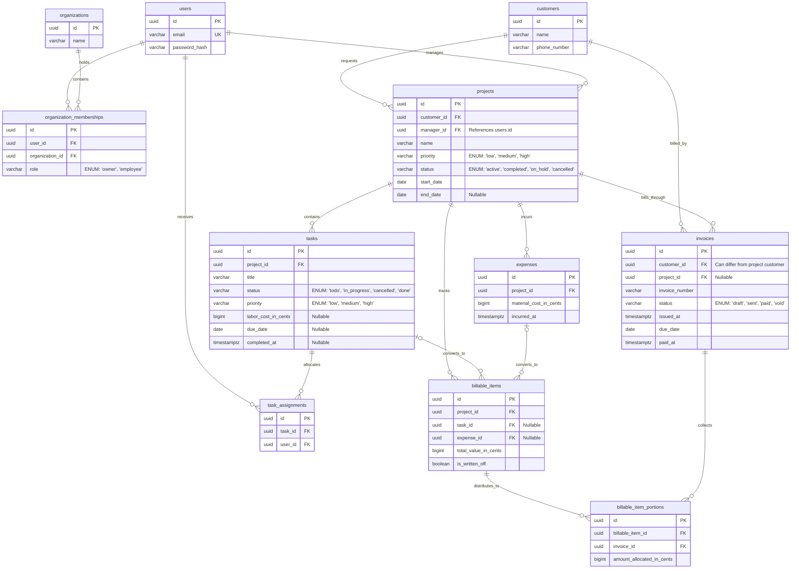

# Database Architecture

This document specifies the physical data relationships and core implementation decisions designed to support the Service Tenant ERP.

## Core Design Decisions

### Multi-Tenancy & Workspace Isolation

* **Workspace Isolation:** Every operational record links to an `Organization` UUID to guarantee strict cross-tenant data privacy.
* **Global Identity:** Users maintain a single global credential profile (`UNIQUE(email)`). Access rights are isolated within an`organization_memberships` join table.
* **Pragmatic Denormalization:** Cascades `organization_id` down to ever tab to bypass deep relational joins and safely filter data in a single, fast operation.
* **Unified Role-Based Access Control:** Merges all internal actors (Owners and Employees) into the `User` entity. Permissions are dynamically evaluated at runtima based on the membership role.
* **PostgreSQL Native Engine:** Schema targets PostgreSQL natively, leveraging explicit foreing keys and optimized composite indexes for tenant-scoped lookups.
* **Tenant Protection:** Enforces `ON DELETE RESTRICT` on the `organizations` database to prevent cascading data loss.

### Financial Integrity & Audit Trails

* **Audit Preservation:** Invoices are never physically deleted. Canceled transactions switch to a `void` status to maintain standard accounting history.
* **Decoupled Pricing:** Billable Items stores an independent mutable pricing. Future modifications to the source task o expense do not mutate existing generated Items.
* **Inmutable Portions:** Once a billable portion is allocated to an invoice, its allocated amount is frozen. This enables safe, dynamic recalculation of remaining unbilled balances.

### Modeling Conventions

* **Physical Pluralization:** Maps documentation entities (singular) to plural lowercase PostgreSQL tables (`users`, `projects`) to prevent SQL reserved keyword collisions.
* **Diagram Optimization:** Ommits operational metadata (`created_at`, `updated_at`, `is_active`, `notes`, `description`, `organization_id`) from visual ERD diagrams to keep the focus strictlty on core business domain boundaries.

## Entity-Relationship Diagram (ERD)

## Data Dictionay & Schema Specifications

### 1. `organizations`
Root tenant entity defining isolation boundaries.

| Column | PostgreSQL Type | Constraints | Description |
| :--- | :--- | :--- | :--- |
| `id` | `UUID` | `PRIMARY KEY`, `DEFAULT gen_random_uuid()` | Unique tenant identifier. |
| `name` | `VARCHAR(100)` | `NOT NULL`, `CHECK(LENGTH(TRIM(name)) >= 2)` | Legal or display name of the business. Enforces a minimum length of 2 printable characters. |
| `description` | `TEXT` | `NULLABLE` | Optional summary or overview of the organization. |
| `created_at` | `TIMESTAMPTZ` | `NOT NULL`, `DEFAULT NOW()` | Creation audit timestamp. |
| `updated_at` | `TIMESTAMPTZ` | `NOT NULL`, `DEFAULT NOW()` | Modification audit timestamp. |

### 2. `users`
Tenant-scoped user profiles.

| Column | PostgreSQL Type | Constraints | Description |
| :--- | :--- | :--- | :--- |
| `id` | `UUID` | `PRIMARY KEY`, `DEFAULT gen_random_uuid()` | Unique user identifier. |
| `name` | `VARCHAR(150)` | `NOT NULL`, `CHECK(LENGTH(TRIM(name)) >= 2)` | Full display name. Prevents empty or whitespace-only names. |
| `email` | `VARCHAR(254)` | `NOT NULL`, `UNIQUE`, `CHECK (email ~* '^[a-z0-9._%+-]+@[a-z0-9-]+(\.[a-z0-9-]+)*\.[a-z]{2,}$')` | Login email identifier. Validates basic email formatting via case-insensitive regex. |
| `password_hash` | `TEXT` | `NOT NULL` | Hashed credential. |
| `is_active`| `BOOLEAN` | `NOT NULL`, `DEFAULT TRUE` | Soft-deletion flag. |
| `created_at` | `TIMESTAMPTZ` | `NOT NULL`, `DEFAULT NOW()` | Creation audit timestamp. |
| `updated_at` | `TIMESTAMPTZ` | `NOT NULL`, `DEFAULT NOW()` | Modification audit timestamp. |

### 3. `organization_memberships`
Junction entity controlling isolated workspace membership and access role.

| Column | PostgreSQL Type | Constraints | Description |
| : --- | : --- | : --- | : --- |
| `id` | `UUID` | `PRIMARY KEY`, `DEFAULT gen_random_uuid()` | Unique mermbership identifier. |
| `organization_id` | `UUID` | `NOT NULL`, `REFERENCES organizations(id) ON DELETE RESTRICT` | Associated workspace scope. |
| `user_id` | `UUID` | `NOT NULL`, `REFERENCES users(id) ON DELETE CASCADE` | Associated global user account. |
| `name` | `VARCHAR(150)` | `NOT NULL`, `CHECK(LENGTH(TRIM(name)) >= 2)` | Workspace-specific display name for the user profile. |
| `role` | `VARCHAR(20)` | `NOT NULL`, `CHECK(role IN ('owner', 'employee'))` | Workspace permission level. |
| `is_active`| `BOOLEAN` | `NOT NULL`, `DEFAULT TRUE` | User access to workspace soft-deletion flag. |
| `notes` | `TEXT` | `NULLABLE` | Internal workspace administrative notes regarding this profile. |
| `created_at` | `TIMESTAMPTZ` | `NOT NULL`, `DEFAULT NOW()` | Creation audit timestamp. |
| `updated_at` | `TIMESTAMPTZ` | `NOT NULL`, `DEFAULT NOW()` | Modification audit timestamp. |

> **Composite Constraint:** `UNIQUE (`organization_id`, `user_id`)` ensures a user account can only hold one membership profile per workspace.

### 4. `customers`
External client profiles managed by the organization.

| Column | PostgreSQL Type | Constraints | Description |
| : --- | : --- | : --- | : --- |
| `id` | `UUID` | `PRIMARY KEY`, `DEFAULT gen_random_uuid()` | Unique customer identifier. |
| `organization_id` | `UUID` | `NOT NULL`, `REFERENCES organizations(id) ON DELETE RESTRICT` | Tenant ownership key. |
| `name` | `VARCHAR(150)` | `NOT NULL`, `CHECK(LENGTH(TRIM(name)) >= 2)` | Display or legal name of the client company. Prevents empty or whitespace-only names. |
| `phone_number` | `VARCHAR(30)` | `NOT NULL`, `CHECK (phone_number ~ '^\+?[0-9\s\-()]+$')` | Primary contact number. Must include a '+' followed by the country code and digits only. |
| `notes` | `TEXT` | `NULLABLE` | Internal CRM notes. |
| `is_active`| `BOOLEAN` | `NOT NULL`, `DEFAULT TRUE` | Soft-deletion flag. |
| `created_at` | `TIMESTAMPTZ` | `NOT NULL`, `DEFAULT NOW()` | Creation audit timestamp. |
| `updated_at` | `TIMESTAMPTZ` | `NOT NULL`, `DEFAULT NOW()` | Modification audit timestamp. |

> **Composite Constraint:** `UNIQUE (`organization_id`, `name`)` prevents duplicated customer profiles from being created within the same business environment.

### 5. `projects`
Primary operation container for tasks, costs, and invoicing.

| Column | PostgreSQL Type | Constraints | Description |
| : --- | : --- | : --- | : --- |
| `id` | `UUID` | `PRIMARY KEY`, `DEFAULT gen_random_uuid()` | Unique project identifier. |
| `organization_id` | `UUID` | `NOT NULL`, `REFERENCES organizations(id) ON DELETE RESTRICT` | Tenant ownership key. |
| `customer_id` | `UUID` | `NOT NULL`, `REFERENCES customers(id) ON DELETE RESTRICT` | External client sponsoring the project. |
| `manager_id` | `UUID` | `NOT NULL`, `REFERENCES users(id) ON DELETE RESTRICT` | Designated internal manager (Owner or Employee). |
| `name` | `VARCHAR(150)` | `NOT NULL`, `CHECK(LENGTH(TRIM(name)) >= 2)` | Project title. Ensures descriptive names. |
| `description` | `TEXT` | `NULLABLE` | Additional information on project scope, objectives and workflow. |
| `priority` | `VARCHAR(10)` | `NOT NULL`, `CHECK (priority IN ('low', 'medium', 'high'))` | Business urgency level in completing the project. |
| `status` | `VARCHAR(15)` | `NOT NULL`, `CHECK (status IN ('active', 'completed', 'on_hold', 'cancelled'))` | Lifecycle state. |
| `start_date` | `DATE` | `NULLABLE` | Planned start. |
| `end_date` | `DATE` | `NULLABLE` | Planned end. |
| `created_at` | `TIMESTAMPTZ` | `NOT NULL`, `DEFAULT NOW()` | Creation audit timestamp. |
| `updated_at` | `TIMESTAMPTZ` | `NOT NULL`, `DEFAULT NOW()` | Modification audit timestamp. |

### 6. `tasks`
Work unit, may convert to billable items.

| Column | PostgreSQL Type | Constraints | Description |
| : --- | : --- | : --- | : --- |
| `id` | `UUID` | `PRIMARY KEY`, `DEFAULT gen_random_uuid()` | Unique task identifier. |
| `organization_id` | `UUID` | `NOT NULL`, `REFERENCES organizations(id) ON DELETE RESTRICT` | Tenant ownership key. |
| `project_id` | `UUID` | `NOT NULL`, `REFERENCES projects(id) ON DELETE CASCADE ` | Parent project container. |
| `title` | `VARCHAR(300)` | `NOT NULL`, `CHECK(LENGTH(TRIM(title)) >= 2)` | Short summary of the work unit. |
| `description` | `TEXT` | `NULLABLE` | Task execution details. |
| `status` | `VARCHAR(15)` | `NOT NULL`, `CHECK (status IN ('todo', 'in_progress', 'cancelled', 'done'))` | Task execution state. |
| `priority` | `VARCHAR(10)` | `NOT NULL`, `CHECK (priority IN ('low', 'medium', 'high'))` | Task urgency classification. |
| `labor_cost` |`BIGINT` | `NULLABLE`, `CHECK(labor_cost >= 0)` | Internal human resource cost. |
| `due_date` | `DATE` | `NULLABLE` | Target completion date. |
| `completed_at` | `TIMESTAMPZ` | `NULLABLE` | Timestamp when task reach `done` state. |
| `created_at` | `TIMESTAMPTZ` | `NOT NULL`, `DEFAULT NOW()` | Creation audit timestamp. |
| `updated_at` | `TIMESTAMPTZ` | `NOT NULL`, `DEFAULT NOW()` | Modification audit timestamp. |

### 7. `task_assignments`
Mapping junction table linking users to tasks.

| Column | PostgreSQL Type | Constraints | Description |
| : --- | : --- | : --- | : --- |
| `id` | `UUID` | `PRIMARY KEY`, `DEFAULT gen_random_uuid()` | Unique assignment identifier. |
| `organization_id` | `UUID` | `NOT NULL`, `REFERENCES organizations(id) ON DELETE RESTRICT` | Tenant ownership key. |
| `task_id` | `UUID` | `NOT NULL`, `REFERENCES tasks(id) ON DELETE CASCADE` | Assigned task. Deleting a task purges its assignments. |
| `user_id` | `UUID` | `NOT NULL`, `REFERENCES users(id) ON DELETE CASCADE` | Assigned user. |
| `created_at` | `TIMESTAMPTZ` | `NOT NULL`, `DEFAULT NOW()` | Creation audit timestamp. |
| `updated_at` | `TIMESTAMPTZ` | `NOT NULL`, `DEFAULT NOW()` | Modification audit timestamp. |

### 8. `expenses`
Direct project-level cost incurred during operation.

| Column | PostgreSQL Type | Constraints | Description |
| : --- | : --- | : --- | : --- |
| `id` | `UUID` | `PRIMARY KEY`, `DEFAULT gen_random_uuid()` | Unique expense identifier. |
| `organization_id` | `UUID` | `NOT NULL`, `REFERENCES organizations(id) ON DELETE RESTRICT` | Tenant ownership key. |
| `project_id` | `UUID` | `NOT NULL`, `REFERENCES projects(id) ON DELETE RESTRICT` | Parent project container. |
| `material_cost_in_cents` | `BIGINT` | `NOT NULL`, `CHECK (material_cost_in_cents >= 0)` | Cost of physical items or third-party tools. |
| `incurred_at` | `TIMESTAMPTZ` | `NOT NULL`, `DEFAULT NOW()` | Timestamp when the expense ocurred. |
| `created_at` | `TIMESTAMPTZ` | `NOT NULL`, `DEFAULT NOW()` | Creation audit timestamp. |
| `updated_at` | `TIMESTAMPTZ` | `NOT NULL`, `DEFAULT NOW()` | Modification audit timestamp. |

### 9. `billable_items`
Financial charge generated for client billing. Can be split across multiple invoicing.

| Column | PostgreSQL Type | Constraints | Description |
| : --- | : --- | : --- | : --- |
| `id` | `UUID` | `PRIMARY KEY`, `DEFAULT gen_random_uuid()` | Unique billable item identifier. |
| `organization_id` | `UUID` | `NOT NULL`, `REFERENCES organizations(id) ON DELETE RESTRICT` | Tenant ownership key. |
| `project_id` | `UUID` | `NOT NULL`, `REFERENCES projects(id) ON DELETE RESTRICT` | Parent project container. |
| `task_id` | `NULLABLE`, `REFERENCES tasks(id) ON DELETE RESTRICT` | Source task reference. |
| `expense_id` | `NULLABLE`, `REFERENCES expense(id) ON DELETE RESTRICT` | Source expense reference. |
| `total_value_in_cents` | `BIGINT` | `NOT NULL`, `CHECK(total_value_in_cents >= 0)` | Amount to be charged to the client. |
| `is_written_off` | `BOOLEAN` | `NOT NULL`, `DEFAULT FALSE` | Status flag marking a billing attempt as cancelled or written off, allowing a new billable item to be generated for the source. | 
| `created_at` | `TIMESTAMPTZ` | `NOT NULL`, `DEFAULT NOW()` | Creation audit timestamp. |
| `updated_at` | `TIMESTAMPTZ` | `NOT NULL`, `DEFAULT NOW()` | Modification audit timestamp. |

> **Check Constraint:** `CHECK (task_id IS NULL OR expense_id IS NULL)` enforces that a billable item originates from only one source type (task, expense or direct charge).
> **Partial Unique Index:** `CREATE UNIQUE INDEX indx_billable_items_unique_active_task ON billable_items (task_id) WHERE is_written_off = FALSE AND task_id IS NOT NULL`  ensures a task can only have one active non-written-off billable item at a time.
> **Partial Unique Index:** `CREATE UNIQUE INDEX indx_billable_items_unique_active_expense ON billable_items (expense_id) WHERE is_written_off = FALSE AND expense_id IS NOT NULL`  ensures a expense can only have one active non-written-off billable item at a time.

### 10. `billable_item_portions`
Line-item splits for billing. Links a specific dollar amount of a billable item to a specific invoice.

| Column | PostgreSQL Type | Constraints | Description |
| : --- | : --- | : --- | : --- |
| `id` | `UUID` | `PRIMARY KEY`, `DEFAULT gen_random_uuid()` | Unique portion identifier. |
| `organization_id` | `UUID` | `NOT NULL`, `REFERENCES organizations(id) ON DELETE RESTRICT` | Tenant ownership key. |
| `billable_item_id` | `UUID` | `NOT NULL`, `REFERENCE billable_items(id) ON DELETE RESTRICT` | Parent billable item. |
| `invoice_id` | `UUID` | `NOT NULL`, `REFERENCE invoices(id) ON DELETE RESTRICT` | Target invoice record. |
| `amount_allocated_in_cents` | `BIGINT` | `NOT NULL`, `CHECK(amount_allocated_in_cents > 0)` | Exact amount allocated to the target invoice. |
| `created_at` | `TIMESTAMPTZ` | `NOT NULL`, `DEFAULT NOW()` | Creation audit timestamp. |
| `updated_at` | `TIMESTAMPTZ` | `NOT NULL`, `DEFAULT NOW()` | Modification audit timestamp. |

> **Business Invariant (Use Case Layer/Trigger):** `SUM(amount_allocated_in_cents)` across all active (non-void invoice) portions belonging to a single `billable_item_id` must not exceed `billable_items.total_value_in_cents`.
> **Lifecycle & Immutability Invariant:** Rows may only be inserted or deleted while the target `invoice_id.status` is `draft`. Once created portions are completely immutable. Corrections must be performed by deleting the row on a `draft` invoice and re-allocating.

### 11. `invoices`
Formal billing document issued to customers.

| Column | PostreSQL Type | Constraints | Description |
| : --- | : --- | : --- | : --- |
| `id` | `UUID` | `PRIMARY KEY`, `DEFAULT gen_random_uuid()` | Unique invoice identifier. |
| `organization_id` | `UUID` | `NOT NULL`, `REFERENCES organizations(id) ON DELETE RESTRICT` | Tenant ownership key. |
| `customer_id` | `UUID` | `NOT NULL`, `REFERENCES customers(id) ON DELETE RESTRICT` | Target client billed. |
| `project_id` | `UUID` | `NOT NULL`, `REFERENCES projects(id) ON DELETE RESTRICT` | Parent associated project. |
| `invoice_number` | `VARCHAR(50)` | `NOT NULL` | Unique invoice code per tenant. |
| `status` | `VARCHAR(15)` | `NOT NULL`, `CHECK (status IN ('draft', 'sent', 'paid', 'void'))` | Lifecycle state. |
| `issued_at` | `TIMESTAMPTZ` | `NULLABLE` | Timestamp when the invoice transitioned to 'sent'. |
| `due_date` | `DATE` | `NULLABLE` | Payment due date. |
| `paid_at` | `TIMESTAMPTZ` | `NULLABLE` | Timestamp when payment was confirmed. |
| `created_at` | `TIMESTAMPTZ` | `NOT NULL`, `DEFAULT NOW()` | Creation audit timestamp. |
| `updated_at` | `TIMESTAMPTZ` | `NOT NULL`, `DEFAULT NOW()` | Modification audit timestamp. |

> **Composite Constraint:** `UNIQUE (organization_id, invoice_number)` guarantees unique invoice numbers per tenant organization.
> **State Consistencia Check:** `Enforces valid timestamp combinations accross the invoice lifecycle:
* `status = 'draft'` &rarr; `issued_at IS NULL AND paid_at IS NULL`
* `status = 'sent'` &rarr; `issued_at IS NOT NULL AND paid_at IS NULL`
* `status = 'paid'` &rarr; `issued_at IS NOT NULL AND paid_at IS NOT NULL`